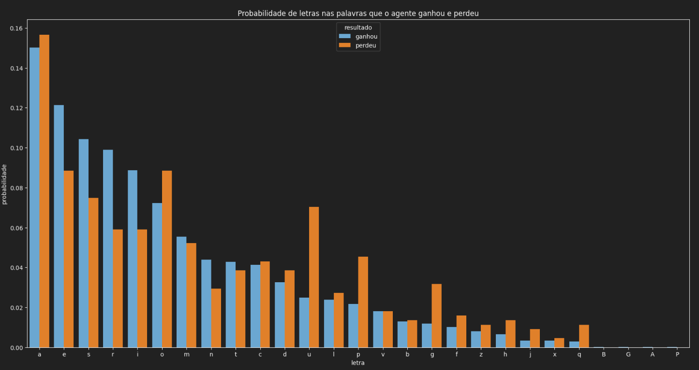

# Alpha-Hangman

Implementação e avaliação de um jogador de forca, utilizando os conceitos de Álgebra Linear.

## Autores
- Marcelo Rabello Barranco
- Thomas Chiari Ciocchetti de Souza

## Utilização
1. Verifique se possui Python 3.9 ou superior instalado em sua máquina.
2. Clone o repositório utilizando o comando `git clone https://github.com/thomaschiari/Alpha-Hangman.git`.
3. Acesse a pasta do projeto e instale as dependências utilizando o comando `pip install -r requirements.txt`.
4. Acesse o arquivo [`demo.ipynb`](demo.ipynb) e execute as células para ver o funcionamento do projeto e acompanhar as análises elaboradas.

## Resumo
### Metodologia
O projeto visa utilizar o conceito de Entropia, além de outros conceitos de Álgebra Linear e Teoria da Informação, para realizar um jogador de forca.
Para isso, o grupo utilizou uma implementação de um jogo, disponível em [`JogoDeForca`](JogoDeForca.py), que permite a interação com o jogador.
Após isso, o grupo elaborou um agente que realiza as escolhas de letras, disponível em [`Agent`](Agent.py).
O agente irá selecionar a letra com maior frequência dentre as palavras restantes como sua jogada, recebendo um feedback do jogo.
Por fim, o grupo elaborou uma análise descritiva e visual para entender o comportamento do agente, disponível em [`demo.ipynb`](demo.ipynb).

### Resultados
No teste realizado com 1000 iterações, o agente obteve uma porcentagem de vitória de mais de 90%.
Realizando uma análise das entropias das letras selecionadas pelo agente, é possível notar que a letra mais frequente na lista de palavras iterada pelo agente é, também, a letra que apresenta maior entropia.
O cálculo da entropia se dá pela fórmula:

$$
H(X) = -\sum_{i=1}^{n} p(x_i) \log p(x_i)
$$

Onde $p(x_i)$ é a probabilidade de ocorrência do evento $x_i$, ou seja, a frequência da letra $x_i$ na lista de palavras iterada pelo agente.

Como o agente seleciona a letra com maior frequência, é esperado que também seja a com maior entropia, visto que fornece poucas informações acerca da palavra que estamos tentando adivinhar.
Caso o jogador selecionasse uma palavra com baixa entropia, a probabilidade de estar correto é bem menor, porém caso esteja, o jogador terá muito mais informação acerca da palavra do que anteriormente, reduzindo a entropia do sistema.
Contudo, essa não é uma estratégia ótima pois, como já dito, a probabilidade de uma letra com baixa entropia estar presente na palavra é bem menor que uma com alta entropia.

Nas palavras que o agente erra, como pode ser visto no arquivo [`demo.ipynb`](demo.ipynb), as letras que estão presentes possuem uma frequência e, portanto, uma entropia menor do que as letras que não estão presentes.
Isso é evidenciado na figura a seguir:

Em resumo, o agente, selecionando a letra de maior frequência e entropia, consegue obter uma alta taxa de acerto, porém caso selecionasse uma letra com baixa entropia, se estivesse certo, teria muito mais informação acerca da palavra do que anteriormente.